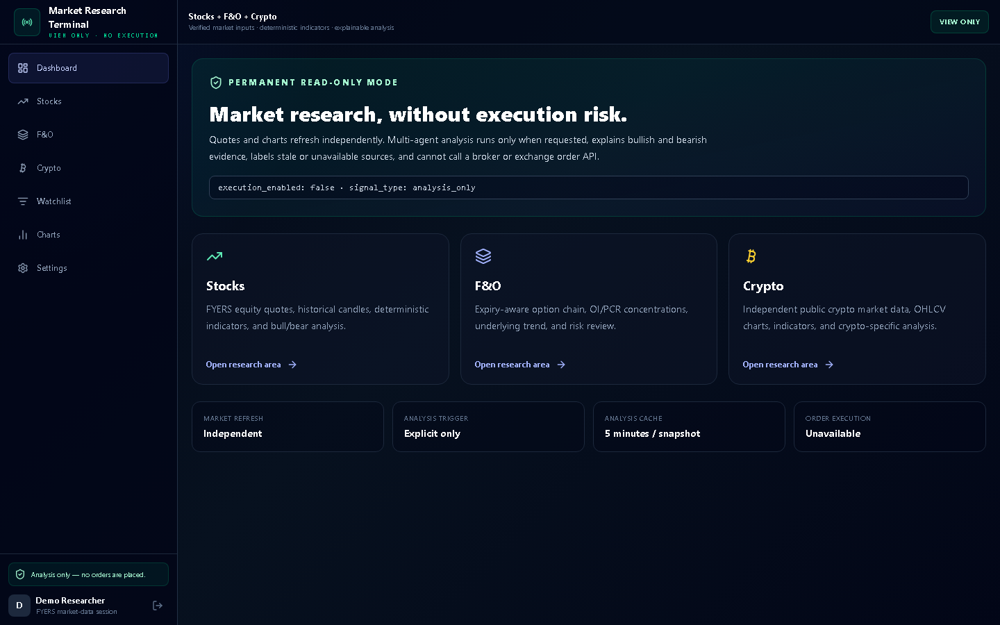
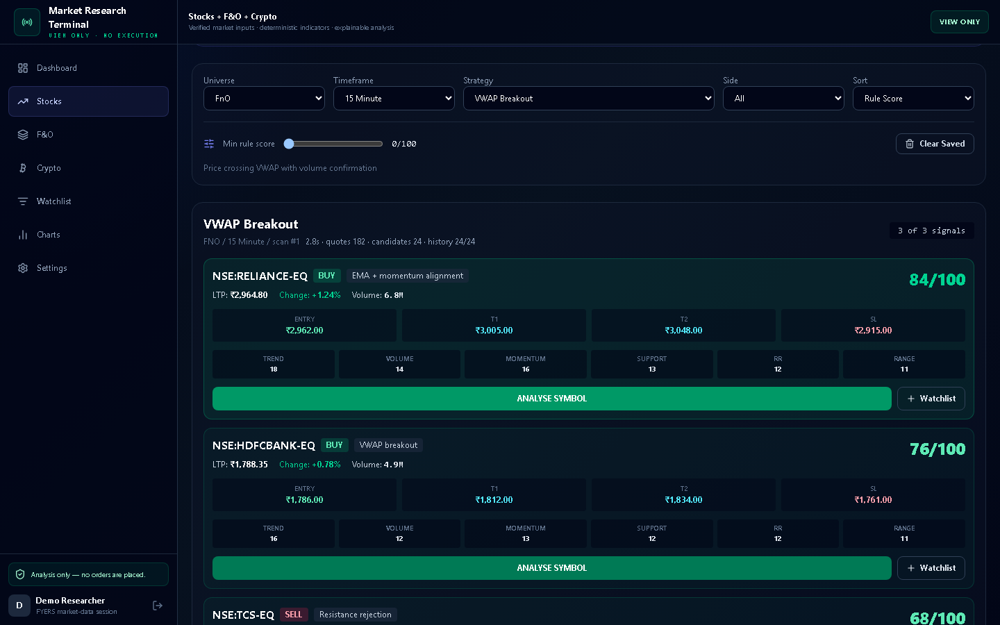
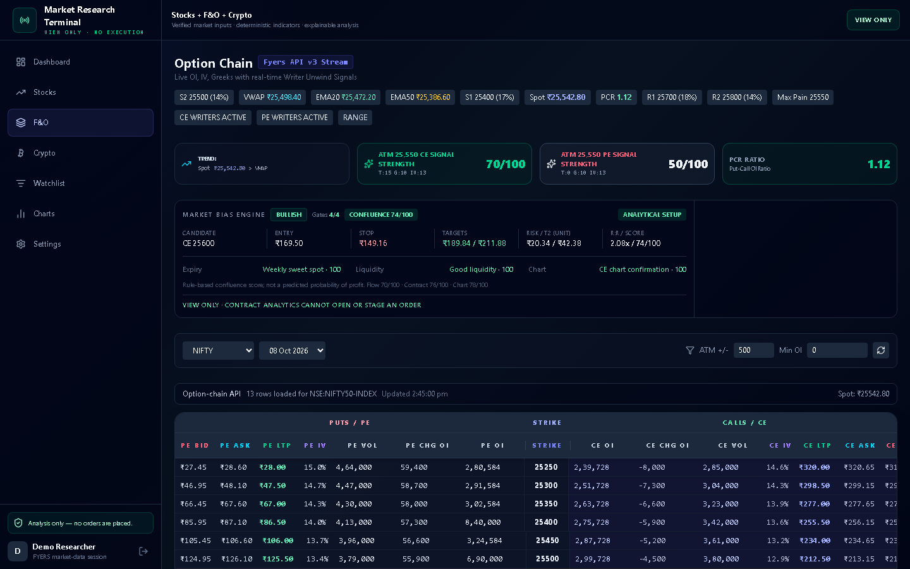
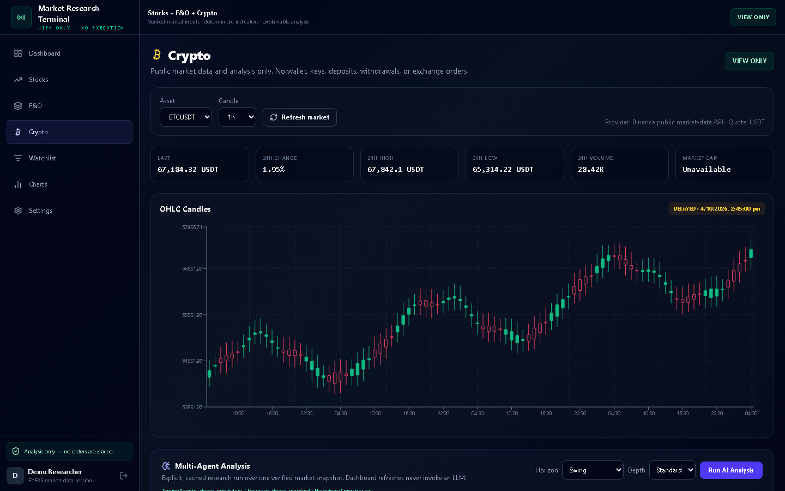
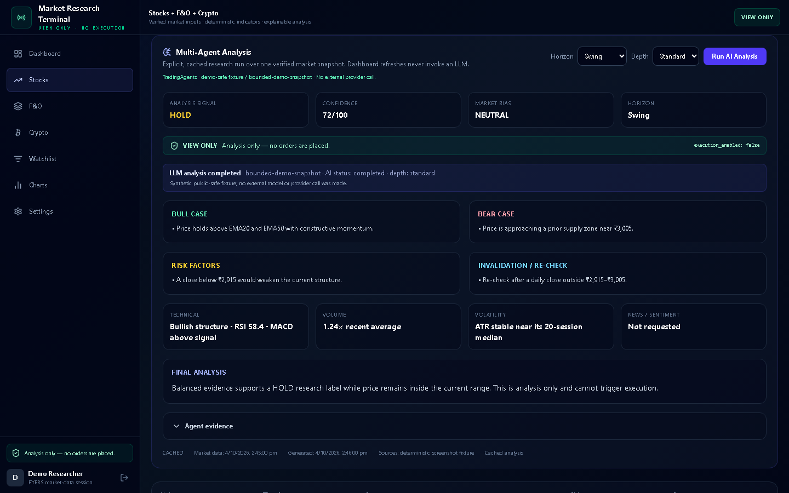

# Market Research Terminal

[](https://github.com/raazlehra/market-research-terminal/actions/workflows/ci.yml)

Market Research Terminal is a local-first, read-only research application for Indian stocks, F&O, futures, and public cryptocurrency market data. It combines verified market snapshots, deterministic Python indicators, optional local multi-agent analysis, and offline historical backtesting.

> **This project is for market research and analysis only. It does not provide live order-placement capability.**

Nothing in this repository is financial advice. Rule scores, AI conclusions, simulated results, and historical metrics are not promises of accuracy, profitability, or future performance.

## Capabilities

- **Stocks:** FYERS quotes and candles with local SMA, EMA, RSI, MACD, Bollinger Bands, ATR, support/resistance, volume, and trend calculations.
- **F&O:** FYERS option-chain and expiry data, PCR, OI concentration, important strikes, supplied IV where available, and active-futures discovery with spot/future basis.
- **Crypto:** BTC/USDT research using Binance public ticker and kline endpoints. No Binance credentials, wallet, account, or trading endpoint is used.
- **Deterministic analysis:** Market calculations run locally in Python and do not require an LLM.
- **Optional AI analysis:** TradingAgents helpers and a local Ollama model power bounded Technical, Bull, Bear, Risk, and Final roles only after the user selects **Run AI Analysis**.
- **Historical backtesting:** Read-only equity-history acquisition, an incremental SQLite cache, normalized CSV export, deterministic replay, simulated fills, costs, metrics, and empirical score bands.

Unsupported data remains `Unavailable`; the application does not invent Greeks, news, fundamentals, sentiment, or market values.

## Safety model

- The active application is view-only. It exposes research screens, not broker execution controls.
- The concrete FYERS client has no place, modify, cancel, exit-position, or square-off implementation.
- Legacy live-mutation routes are HTTP `403` traps.
- AI results must retain `signal_type = analysis_only` and `execution_enabled = false`.
- TradingAgents receives a bounded snapshot and no broker object, credential, wallet, or execution tool.
- Backtesting execution is simulated locally against historical candles; it cannot mutate a brokerage account.
- FYERS access tokens are exchanged server-side and encrypted at rest. They are never returned to the frontend.

See [Read-only market research architecture](docs/read-only-market-research.md) for the detailed trust boundaries and limitations.

## Architecture

| Area | Technology | Responsibility |
| --- | --- | --- |
| Frontend | React, TypeScript, Vite, Tailwind CSS | View-only research UI and explicit AI trigger |
| Backend | FastAPI, Python, SQLAlchemy | OAuth/session handling, normalized market data, indicators, analysis, and cache APIs |
| Indian market data | FYERS Developer API | Server-side OAuth, profile, quotes, history, depth, options, expiries, futures metadata, and market-data WebSocket |
| Crypto | Binance public market-data endpoints | Public BTC/USDT ticker and OHLCV; no account access |
| Deterministic research | Local Python | Indicators, PCR, OI summaries, basis, signals, validation, and freshness checks |
| Optional AI worker | TradingAgents 0.5.2 + Ollama + `qwen3:4b-instruct` | Loopback-only process for explicit multi-agent interpretation over a bounded snapshot |
| Backtesting | Python + SQLite + CSV | Historical acquisition, caching, deterministic replay, simulated execution, and metrics |

Deterministic calculations are authoritative for factual numeric values. Optional AI may interpret those values, but it is not allowed to manufacture facts or execute trades.

## Screenshots

These screenshots use deterministic public-safe demonstration data and contain no brokerage credentials or real account information.

### Dashboard



### Stocks



### F&O



### Crypto



### Optional AI analysis



## Prerequisites

- Git.
- **Python 3.11 recommended and validated on Windows.**
- **Node.js `20.19+` or `22.12+`** and npm, matching Vite 7's engine requirement.
- A FYERS account and FYERS Developer API v3 application for Indian-market data.
- Ollama only if local AI analysis is desired.

The current FYERS SDK pins a transitive package combination that did not clean-install under Python 3.13 in the Windows acceptance environment. Python 3.11 is therefore the documented Windows runtime; newer Python versions should not be assumed compatible without a fresh dependency check. The verified frontend environment used Node 24 and npm 11.

## Clean setup

### 1. Clone and create the backend environment

```bash
git clone https://github.com/raazlehra/market-research-terminal.git
cd market-research-terminal
python -m venv .venv
```

Activate it:

```powershell
# Windows PowerShell
.\.venv\Scripts\Activate.ps1
```

```bash
# macOS/Linux
source .venv/bin/activate
```

Install the required backend and contributor packages:

```bash
python -m pip install --upgrade pip
python -m pip install -r backend/requirements-dev.txt
python -m pip check
```

`backend/requirements-dev.txt` includes the base backend manifest. For a runtime-only installation, install `backend/requirements.txt` instead. Do **not** install `backend/requirements-ai.txt` into this environment: FYERS 3.1.18 requires `requests==2.31.0`, while the pinned TradingAgents revision requires `requests>=2.32.4`. Normal dashboard operation and all deterministic research use only this main environment.

### 2. Create the local environment file

The backend intentionally loads `backend/.env`:

```powershell
# Windows PowerShell
Copy-Item .env.example backend/.env
```

```bash
# macOS/Linux
cp .env.example backend/.env
```

Edit `backend/.env` and replace every placeholder. Never commit or share this file.

Generate an application-session secret locally:

```bash
python -c "import secrets; print(secrets.token_urlsafe(48))"
```

Generate the FYERS token-encryption key locally:

```bash
python -c "from cryptography.fernet import Fernet; print(Fernet.generate_key().decode())"
```

Put those generated values into `APP_SESSION_SECRET` and `FYERS_TOKEN_ENCRYPTION_KEY`. Do not leave the `replace_with_...` placeholders in a running setup. The alternative `python -m backend.migrate_tokens --initialize-local-secrets` helper creates values only when those names are absent; it deliberately does not overwrite existing entries.

SQLite is the default local database. Database files, `.env` files, token material, build output, and backtesting caches are ignored by Git.

### 3. Configure FYERS

Create a FYERS Developer API v3 application and configure this exact local callback URL:

```text
http://localhost:8000/fyers/callback
```

Set the corresponding values in `backend/.env`:

```env
FYERS_APP_ID=your_app_id
FYERS_SECRET=your_secret_key
FYERS_REDIRECT_URI=http://localhost:8000/fyers/callback
FRONTEND_URL=http://localhost:5173
```

OAuth flow:

```text
browser -> FYERS login -> backend callback -> server-side code exchange
        -> one-use handoff -> signed application session
```

The access token is encrypted in backend storage and is not sent to the browser. If FYERS rejects or expires the token, sign in again through the application. FYERS availability, limits, pricing, and account requirements are controlled by FYERS and may change; verify current provider documentation before relying on them.

### 4. Install the frontend

For a clean clone, use the lockfile:

```bash
npm ci
```

`npm install` is also available for dependency-development work, but may update `package-lock.json`.

### 5. Start the application

Start the backend from the repository root:

```bash
python -m uvicorn backend.main:app --reload --host 127.0.0.1 --port 8000
```

Start the frontend in another terminal:

```bash
npm run dev -- --host 127.0.0.1
```

Open `http://localhost:5173`, verify the local services, and continue through the FYERS login flow. FastAPI documentation is available locally at `http://127.0.0.1:8000/docs`.

## Optional local AI with Ollama

The AI worker is optional and runs in a second Python 3.11 environment. It listens only on loopback and receives the already bounded, credential-free analysis snapshot. Create the environment without activating the main backend environment:

```powershell
# Windows PowerShell
py -3.11 -m venv .venv-ai
.\.venv-ai\Scripts\Activate.ps1
python -m pip install --upgrade pip
python -m pip install -r backend/requirements-ai.txt
python -m pip check
```

```bash
# macOS/Linux with Python 3.11 available as python3.11
python3.11 -m venv .venv-ai
source .venv-ai/bin/activate
python -m pip install --upgrade pip
python -m pip install -r backend/requirements-ai.txt
python -m pip check
```

Never combine `.venv` and `.venv-ai`. The main backend remains fully usable when the AI worker is absent.

Install Ollama using its official instructions, then download the accepted local model:

```bash
ollama pull qwen3:4b-instruct
```

Enable it in `backend/.env`:

```env
AI_ANALYSIS_ENABLED=true
AI_WORKER_URL=http://127.0.0.1:8124
LLM_PROVIDER=ollama
LLM_MODEL=qwen3:4b-instruct
OLLAMA_BASE_URL=http://127.0.0.1:11434/v1
```

Start Ollama normally. In the activated AI environment, set only the non-secret AI settings and start the loopback worker:

```powershell
$env:AI_ANALYSIS_ENABLED='true'
$env:AI_WORKER_URL='http://127.0.0.1:8124'
$env:LLM_PROVIDER='ollama'
$env:LLM_MODEL='qwen3:4b-instruct'
$env:OLLAMA_BASE_URL='http://127.0.0.1:11434/v1'
python -m backend.ai_worker
```

```bash
AI_ANALYSIS_ENABLED=true \
AI_WORKER_URL=http://127.0.0.1:8124 \
LLM_PROVIDER=ollama \
LLM_MODEL=qwen3:4b-instruct \
OLLAMA_BASE_URL=http://127.0.0.1:11434/v1 \
python -m backend.ai_worker
```

The worker deliberately does not load `backend/.env`, so FYERS secrets, encryption keys, and session secrets are not introduced into the AI process. The main backend and worker must use the same provider, model, base URL, and immutable TradingAgents configuration; a mismatch is rejected.

Dashboard startup, navigation, quote refresh, chart refresh, and market updates do not contact the worker. **Run AI Analysis** sends the bounded snapshot to the worker, validates the structured response in the main backend, and retains the five-minute fingerprinted cache. If the worker is unavailable, deterministic research continues and the AI request fails safely without a hosted-provider fallback.

Hosted model providers are not required. If a user configures one separately, that provider may charge for usage.

### Optional AMD integrated-GPU note

Ollama hardware support varies by operating system, driver, GPU architecture, available shared memory, and Ollama release. On a compatible Windows AMD integrated-GPU setup, a user-level variable such as the following may allow Ollama to consider the iGPU:

```text
OLLAMA_IGPU_ENABLE=1
```

This is an optional machine-specific example, not a universal requirement. Verify the backend reported by Ollama, `ollama ps`, output correctness, memory pressure, and stability before keeping any acceleration setting. Do not install unsupported ROCm packages or driver hacks for this project.

## Historical backtesting

Backtesting is backend-only and uses historical/downloaded data. All entries and exits are simulations; no brokerage mutation is reachable.

### Plan historical acquisition without network access

```bash
python -m backend.backtesting.cli plan-fetch --symbols NSE:SBIN-EQ --resolution 5 --start-date 2026-09-01 --end-date 2026-09-05 --cache-db backtest-data/equity-history.sqlite3
```

### Perform explicitly approved read-only acquisition

```bash
python -m backend.backtesting.cli fetch-equity --symbols NSE:SBIN-EQ --resolution 5 --start-date 2026-09-01 --end-date 2026-09-05 --cache-db backtest-data/equity-history.sqlite3 --execute-read-only
```

The acquisition command accepts no token or credential argument and fails closed unless an authenticated FYERS client is available in that process. It uses only FYERS historical market-data access.

### Inspect and export the cache

```bash
python -m backend.backtesting.cli cache-status --cache-db backtest-data/equity-history.sqlite3

python -m backend.backtesting.cli export-csv --symbols NSE:SBIN-EQ --resolution 5 --cache-db backtest-data/equity-history.sqlite3 --output backtest-results/sbin-5m.csv
```

### Replay the normalized CSV offline

```bash
python -m backend.backtesting.cli run --csv backtest-results/sbin-5m.csv --strategy BREAKOUT --symbols NSE:SBIN-EQ --resolution 5 --score-threshold 50 --fixed-quantity 1
```

The cache is deterministic by provider, symbol, resolution, and timestamp. Replay uses completed candles, next-candle simulated entry, configurable slippage/cost assumptions, deterministic exits, and empirical metrics. It is not an options-profitability simulator and does not prove that a strategy will work live.

Detailed contracts:

- [Deterministic replay and metrics](docs/backtesting-slice1.md)
- [Read-only acquisition and cache](docs/backtesting-acquisition-slice2.md)

## Verification

```bash
python -m compileall -q backend
python -m ruff check backend
python -m pytest backend/tests -q
npx tsc --noEmit
npm run build
git diff --check
```

Ruff and pytest are supplied by `backend/requirements-dev.txt`.

## Limitations

- The current deployment model is a local, single-user, single-backend-process application. Multi-user or multi-worker deployment requires user-scoped FYERS clients and shared session revocation.
- FYERS authentication is interactive and may require fresh login when the provider token expires.
- News, company fundamentals, and sentiment providers are not configured.
- F&O analysis summarizes the current option chain and futures market data; missing Greeks or IV are not fabricated.
- Historical options profitability, live liquidity simulation, partial fills, and changing brokerage/tax schedules are not modeled.
- Local LLM speed and structured-output reliability depend on the selected model and hardware.
- Optional AI requires a separately started loopback worker because the accepted FYERS and TradingAgents releases have incompatible `requests` requirements.
- No model binary, market dataset, or live credential is included in the repository.

## Third-party software and project license

Copyright 2026 Rajendra Kumar

See [THIRD_PARTY_NOTICES.md](THIRD_PARTY_NOTICES.md) for dependency attribution, including the immutable TradingAgents revision.

The original Market Research Terminal project code is licensed under the [Apache License 2.0](LICENSE). Third-party components remain governed by their own licenses as recorded in [THIRD_PARTY_NOTICES.md](THIRD_PARTY_NOTICES.md).
